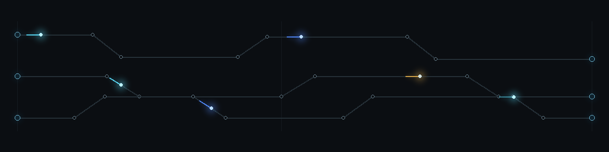

  

<h1 align="center">Parth Sharma</h1>

  Computer Engineering at Purdue University &middot; Class of 2030 
  <a href="https://linkedin.com/in/parth-h-sharma/">LinkedIn</a> &middot; <a href="mailto:sharma.parth.h@gmail.com">Email</a>

---

## Engineering focus

I build systems that turn real-time signals into useful software. My work spans voice-interaction pipelines, event intelligence, and embedded instrumentation; most recently, I contributed to a magnetometer payload that flew on a NASA Student Launch rocket.

I am especially interested in dependable embedded intelligence: on-device adaptation, multimodal sensor fusion, real-time inference, and hardware-software co-design under power and memory constraints.

I am building [Inoculate](https://inoculate.dev), a developer tool that extracts a reference site's visual system, interaction patterns, and motion behavior into structured design context for AI coding agents.

## Selected systems

<table>
  <tr>
    <td width="50%" valign="top">
      <h3><a href="https://github.com/parthsharma234/kelv">Kelv</a></h3>
      
Voice-first interview intelligence system. It coordinates real-time ElevenLabs agents, in-browser audio and posture capture, role-aware prompt composition, per-question scoring, and normalized session persistence with Supabase and local recovery.

      
<code>TypeScript</code> <code>React</code> <code>ElevenLabs</code> <code>Supabase</code>

    </td>
    <td width="50%" valign="top">
      <h3><a href="https://github.com/parthsharma234/nyu-hackathon">Scout</a></h3>
      
Event-intelligence pipeline. A Python ingestion and enrichment backend resolves entities across sources, calculates trend velocity, sentiment, and spike scores, then streams ranked entities and scraper-health telemetry to a React dashboard over REST and WebSockets.

      
<code>Python</code> <code>React</code> <code>REST</code> <code>WebSockets</code>

    </td>
  </tr>
</table>
