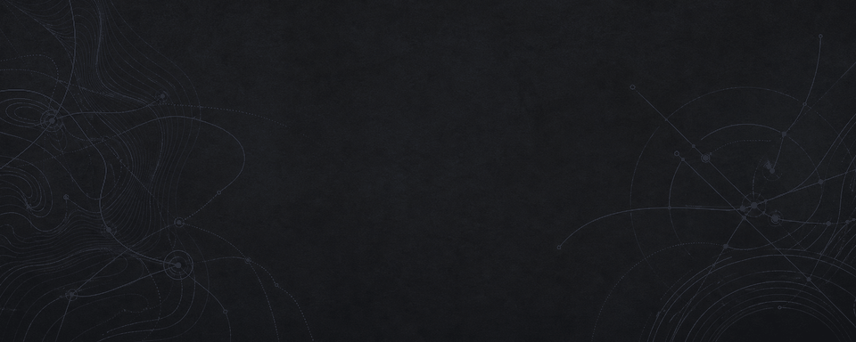

  

# Parth Sharma

Computer Engineering student at Purdue building full-stack and embedded systems. I recently contributed to a magnetometer payload that flew on a NASA Student Launch rocket. My embedded-systems interests include on-device learning, multimodal sensor fusion, and real-time inference under memory and power constraints.

[LinkedIn](https://linkedin.com/in/parth-h-sharma/) &nbsp;&middot;&nbsp; [Email](mailto:sharma.parth.h@gmail.com)

## Selected work

### [Kelv](https://github.com/parthsharma234/kelv)

A TypeScript interview-intelligence platform that combines real-time voice sessions with transcript, audio, and posture signals. Its processing pipeline produces per-question analytics and normalized session results, with Supabase-backed persistence and local fallback.

[Repository](https://github.com/parthsharma234/kelv)

### [Scout](https://github.com/parthsharma234/nyu-hackathon)

A Python and React intelligence pipeline that ingests source feeds, resolves entities, computes mention velocity and sentiment, and publishes ranked trend data plus source-health telemetry over REST and WebSockets.

[Repository](https://github.com/parthsharma234/nyu-hackathon)

## Focus

Systems engineering, full-stack applications, and embedded intelligence. Purdue University, Computer Engineering, class of 2030.
