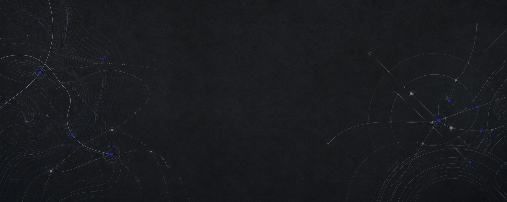

  

# Parth Sharma

Computer Engineering student at Purdue building software products and embedded systems. I recently contributed to a magnetometer payload that flew on a NASA Student Launch rocket.

[LinkedIn](https://linkedin.com/in/parth-h-sharma/) &nbsp;&middot;&nbsp; [Email](mailto:sharma.parth.h@gmail.com)

## Selected work

### [Kelv](https://github.com/parthsharma234/kelv)

A deployed TypeScript web application with ongoing product development.

[Repository](https://github.com/parthsharma234/kelv) &nbsp;&middot;&nbsp; [Live site](https://sol-website-alpha.vercel.app/)

### [Scout](https://github.com/parthsharma234/nyu-hackathon)

A deployed full-stack project for early-stage intelligence, built during a hackathon.

[Repository](https://github.com/parthsharma234/nyu-hackathon) &nbsp;&middot;&nbsp; [Live site](https://scout-jade.vercel.app/) &nbsp;&middot;&nbsp; [Devpost](https://devpost.com/software/scout-svtmd3)

## Focus

Software engineering, full-stack web applications, and systems. Purdue University, Computer Engineering, class of 2030.
